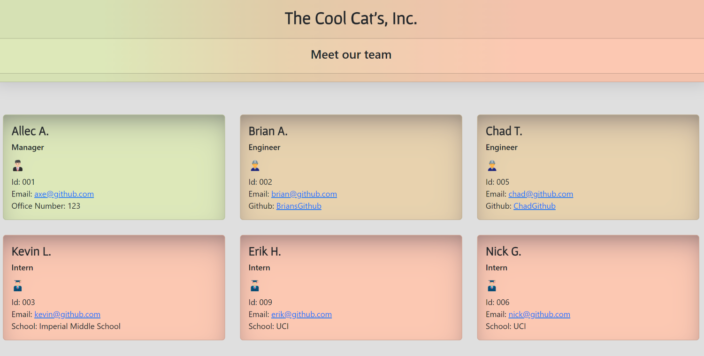

# Team Profile Generator




## Description
- Easily generate a team profile page using inquirer prompts

## Table Of Contents
* [Installation](#installation)
    * [Youtube Walkthrough](#youtube)
* [Usage](#usage)
* [License](#license)
* [Contribution Guidelines](#contribution)
* [Tests](#tests)
* [Deployed Link](#deployed)
* [Contact](#contact)
    * [Github](#github)
    * [Email](#email)

## Installation
- For a video guide, please refer to this [Youtube Walkthrough.](https://www.youtube.com/watch?v=Uk2Ws17BilI)
- Run ``` npm i ``` to install the required dependencies, then run ``` node index.js ``` in the terminal to launch the application.

## Usage
- This program generates an HTML file of your software engineering team, complete with some basic CSS styling. 
  - <strong>The generated HTML file can be found inside the dist folder</strong>. 
- There are 3 employee types to pick from, and the following information will be present in each employee card: 
``` 
1. Manager
    - Name
    - Role (with matching icon)
    - Id
    - Email
    - Office Number
2. Engineer
    - Name
    - Role (with matching icon)
    - Id
    - Github profile
3. Intern
    - Name
    - Role (with matching icon)
    - Id
    - School
```

## License
- This project uses the following license:<br>
     - ***MIT***

## Contribution Guidelines
- All contributors are welcome! Please don't hesitate to contact me below to contribute to this project.

## Tests
- Run ``` npm test ``` in the terminal to launch the tests.

## Github Repository: 
- [Team Profile Generator](https://github.com/axe714/Team-Profile-Generator)

## Deployed Link:
- [Team Profile Generator](https://github.com/axe714/Team-Profile-Generator)

## Contact Information:
- [Github Profile - Axe714](www.github.com/axe714)

### Email:
- For inquiries/questions, please reach out to me at axe@github.com